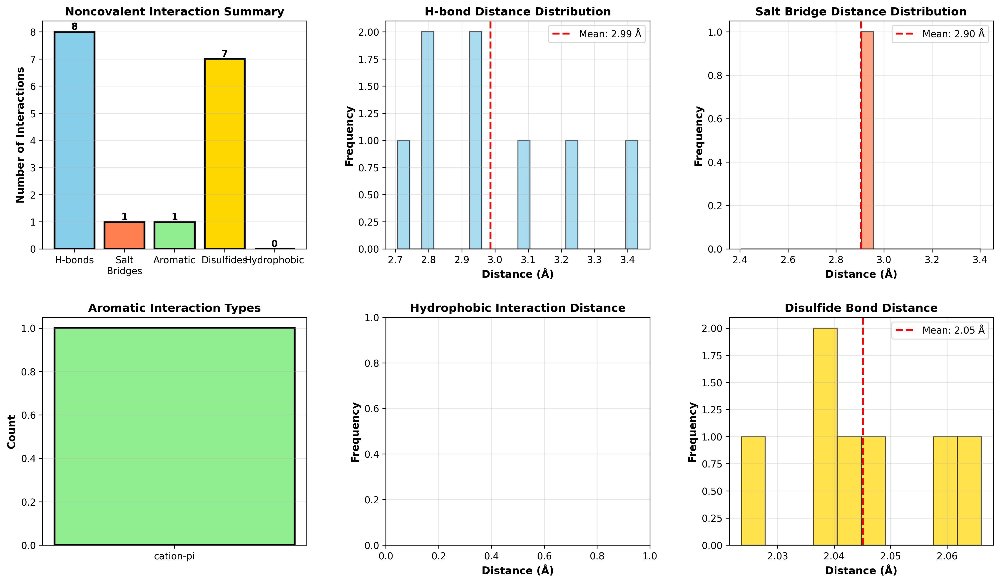

# Summary

Elastic network models (ENMs) and normal mode analysis (NMA) provide an efficient
framework for characterizing collective protein motions underlying functional
transitions, allostery, and protein–protein recognition [@Tirion1996; @Doruker2000].
However, practical application of ENM/NMA approaches is often limited by
fragmented toolchains, heterogeneous parameter choices, and the absence of
unified workflows for ensemble generation, apo–complex comparison, and interface
dynamics analysis [@Cirauqui2021].

DynaMune is an integrated, parameter-aware software platform for ensemble-based
protein dynamics analysis derived from ENM and NMA. Built on the ProDy library
[@Bakan2011], DynaMune unifies normal mode and principal component analysis,
Gaussian and anisotropic network modeling, perturbation response scanning,
domain and hinge decomposition, pocket dynamics, conformational deformation
mapping, and quantitative interface contact persistence analysis within a single
reproducible workflow. The platform supports both command-line execution and an
optional local web interface, enabling routine, publication-ready dynamics
analysis without molecular dynamics simulations.

---

# Statement of need

Protein function is governed by both structure and conformational dynamics.
Although experimental structure determination and AI-based prediction methods
now provide high-quality static models at scale [@Varadi2024; @Abramson2024],
they do not directly capture the collective motions and transition pathways that
underlie catalysis, allostery, and binding-induced remodeling. Molecular dynamics
(MD) simulations can resolve these processes but are computationally expensive
and impractical for high-throughput comparative analysis [@CaballeroManrique2007].

ENM- and NMA-based approaches offer a computationally efficient alternative that
reliably capture low-frequency, functionally relevant motions
[@Tirion1996; @Doruker2000; @Bahar2010]. Despite their maturity, these methods are
underutilized due to fragmented implementations, ad hoc parameter selection, and
limited support for ensemble-driven interpretation and apo–complex comparison
[@Cirauqui2021].

DynaMune addresses these limitations by providing a unified, standardized
platform for ENM/NMA-based protein dynamics, enabling systematic ensemble
generation, consistent parameter usage, and direct comparison between functional
states.

---

# State of the field

Several tools support ENM/NMA-based protein dynamics analysis, including iMODS,
WEBnm@, and Bio3D [@LopezBlanco2014; @Hollup2005; @Grant2020]. These frameworks
provide access to individual analytical components but require manual scripting,
heterogeneous parameter selection, or coordination across multiple programs.

Other tools such as DynaMut and DynaMine focus on mutation impact prediction or
sequence-derived dynamics profiles rather than ensemble-driven conformational
sampling or interface dynamics analysis [@Rodrigues2018; @Cilia2014]. None of
these platforms provide an integrated workflow that unifies ensemble generation,
apo–complex comparison, interface contact persistence mapping, and hinge or
domain decomposition under a consistent parameter architecture.

---

# Software design

DynaMune is implemented in Python and uses ProDy (v2.4 or newer) as its core
computational engine for elastic network modeling, normal mode analysis,
perturbation response scanning, ensemble generation, and dynamics-related
correlation calculations [@Bakan2011]. The platform is organized into modular
components that can be executed independently or as part of a sequential
workflow.

The design emphasizes standardized default parameters derived from validated
benchmark studies while allowing user-defined customization. Ensemble
generation is integrated throughout the workflow to enable statistical
interpretation of flexibility, deformation, and contact persistence. Comparative
analysis modules support direct evaluation of apo and complex states, including
mode overlap, deformation projection, and ensemble-level interface stability.

---

# Research impact statement

DynaMune was validated using two representative benchmark systems. Adenylate
kinase was used to evaluate large-scale domain motions and allosteric transitions,
where the platform reproduced the canonical CORE–LID–NMP displacement pathway,
hinge-localized cracking behavior, and restricted fluctuation regime of the
closed state [@Delarue2002; @Doruker2000].

The ACE2–SARS-CoV-2 spike complex was used to assess interface dynamics and
binding-induced remodeling. DynaMune recovered the experimentally established
Lys353-centered interaction hotspot, persistent interfacial contact networks,
and redistribution of intrinsic motion modes associated with complex formation
[@Lan2020; @Shang2020; @Wrapp2020].

---

# AI usage disclosure

Generative AI tools were used for language refinement during manuscript
preparation. All software development, methodological design, analysis, and
scientific interpretation were performed and verified by the author.

---

# Acknowledgements

The author acknowledges the developers of ProDy for providing the computational
foundation upon which this software is built.

---

# References

